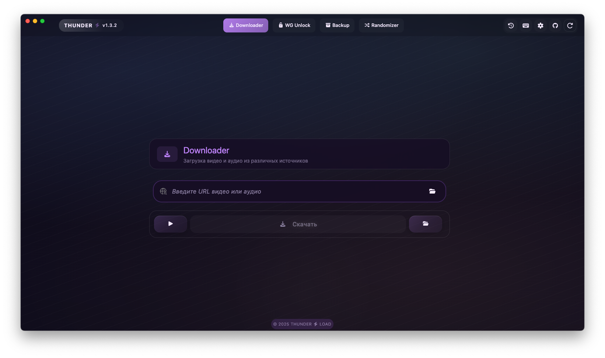
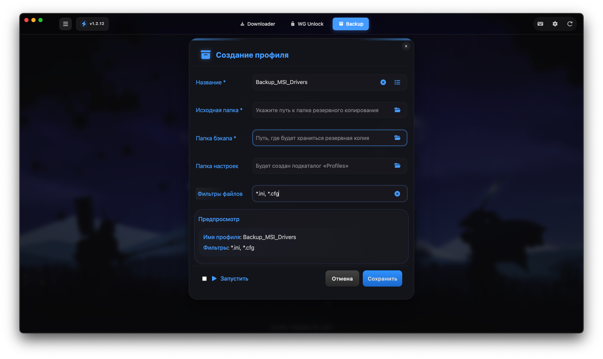
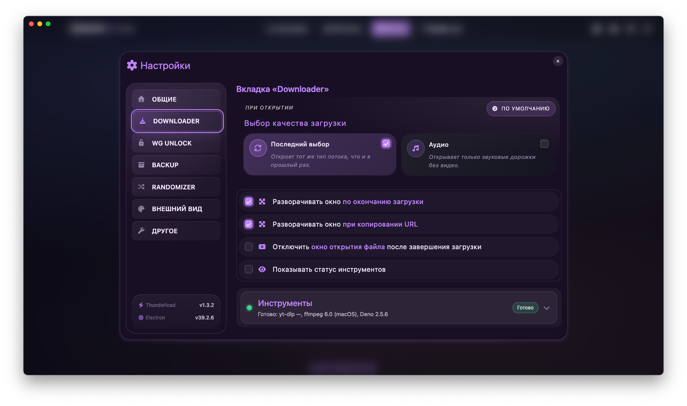
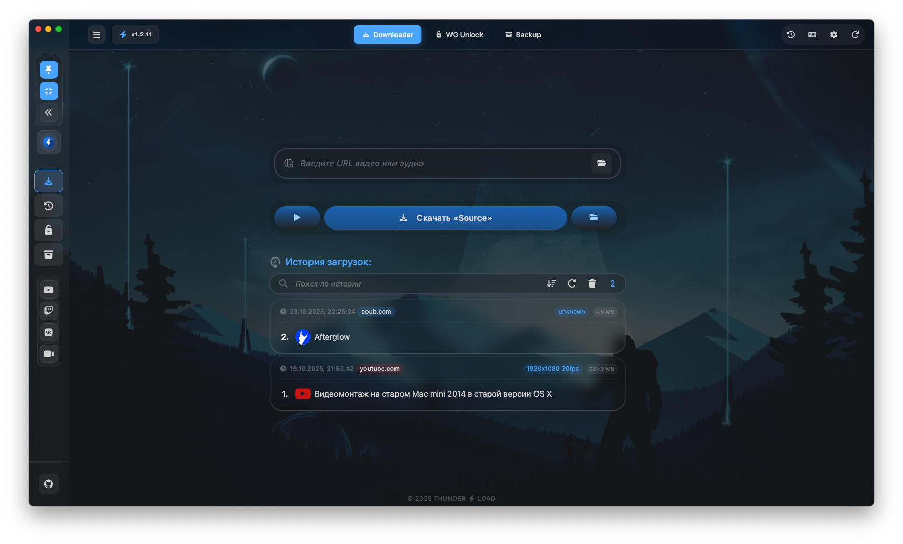

<p align="center">
  
</p>

<h1 align="center">Thunder Load</h1>

<p align="center"><em>Your fast, simple, and reliable video, audio, and file downloader</em></p>

<p align="center">
  <a href="https://github.com/Nagrands/thunder-load-app/actions/workflows/release.yml">
    
  </a>
</p>

---

## Quick Start

Get started with ThunderLoad in just a few steps:

```bash
git clone https://github.com/Nagrands/thunder-load-app.git
cd thunder-load-app
npm install
npm start
```

To build for production:

```bash
npm run build
```

---

## Features

- 🚀 **Fast** video & audio downloading
- 🎯 Supports multiple formats: video (MP4, WebM, MKV, etc.) and audio (MP3, AAC, etc.)
- 📥 Clipboard monitoring for instant link detection
- ⚙️ Quality selection before download
- 📜 Download history with quick access
- 🔄 Automatic in-app updates
- 🖥️ Clean and intuitive interface

## 📸 Screenshots

<p align="center">
  
  
</p>
<p align="center">
  
  
</p>

---

## Tech Stack

- **Electron** — Cross-platform desktop application framework
- **Node.js** — JavaScript runtime
- **npm** — Package manager

---

## Development

Clone the repository and install dependencies:

```bash
git clone https://github.com/Nagrands/thunder-load-app.git
cd thunder-load-app
npm install
```

Run the app in development mode:

```bash
npm start
```

### HTML templates

- The renderer HTML now lives under `templates/` (`layouts`, `pages`, `partials`).
- Edit the `.njk` files and run `npm run templates:build` to regenerate `src/index.html`. The command runs automatically before `npm run dev`, `npm start`, and `npm run build`.
- Use `npm run templates:watch` during UI work to rebuild HTML automatically whenever `.njk` files change.
- Commit both the template changes and the generated `src/index.html` so Electron always has a ready-to-ship entry point.

Build the app for production:

```bash
npm run build
```

---

## Installation

<details>
<summary><strong>macOS Notice</strong></summary>
ThunderLoad for macOS is **not notarized**. When running the app, you may see a warning that it is damaged or cannot be opened.

To run the app:

1. Move the `.app` to `/Applications`.
2. Open Terminal and run:
   ```
   sudo xattr -dr com.apple.quarantine /Applications/Thunder\ Load.app
   ```
3. Then open the app normally.

</details>

---

## Translations

### Русский

ThunderLoad — это современный кроссплатформенный загрузчик видео, аудио файлов, созданный на базе [Electron](https://www.electronjs.org/).  
Разработан для скорости, простоты и комфортного пользовательского опыта.

#### Особенности

- 🚀 Быстрая загрузка видео и аудио
- 🎯 Поддержка множества форматов: видео (MP4, WebM, MKV и др.) и аудио (MP3, AAC и др.)
- 📥 Мониторинг буфера обмена для мгновенного обнаружения ссылок
- ⚙️ Выбор качества перед загрузкой
- 📜 История загрузок с быстрым доступом
- 🔄 Автоматические обновления внутри приложения
- 🖥️ Чистый и интуитивно понятный интерфейс

#### Установка

<details>
<summary><strong>Примечание для macOS</strong></summary>
Приложение ThunderLoad для macOS **не проходит нотарификацию**. При запуске система может показать предупреждение, что приложение повреждено или не может быть открыто.

Чтобы запустить приложение:

1. Переместите `.app` в папку `/Applications`.
2. Откройте Терминал и выполните команду:
   ```
   sudo xattr -dr com.apple.quarantine /Applications/Thunder\ Load.app
   ```
3. Затем откройте приложение обычным способом.

</details>

---

### Українська

ThunderLoad — це сучасний кросплатформений завантажувач відео, аудіо файлів, створений на основі [Electron](https://www.electronjs.org/).  
Розроблений для швидкості, простоти та комфортного користувацького досвіду.

#### Можливості

- 🚀 Швидке завантаження відео та аудіо
- 🎯 Підтримка багатьох форматів: відео (MP4, WebM, MKV тощо) та аудіо (MP3, AAC тощо)
- 📥 Моніторинг буфера обміну для миттєвого виявлення посилань
- ⚙️ Вибір якості перед завантаженням
- 📜 Історія завантажень із швидким доступом
- 🔄 Автоматичні оновлення в додатку
- 🖥️ Чистий та інтуїтивно зрозумілий інтерфейс

#### Встановлення

<details>
<summary><strong>Примітка для macOS</strong></summary>
Додаток ThunderLoad для macOS **не проходить нотаризацію**. Під час запуску система може показати попередження, що додаток пошкоджено або його неможливо відкрити.

Щоб запустити додаток:

1. Перемістіть `.app` до папки `/Applications`.
2. Відкрийте Термінал і виконайте команду:
   ```
   sudo xattr -dr com.apple.quarantine /Applications/Thunder\ Load.app
   ```
3. Після цього відкрийте додаток як зазвичай.

</details>

---

## Contributing

Contributions are welcome! Please open issues and submit pull requests on the [GitHub repository](https://github.com/Nagrands/thunder-load-app).

---

## License

This project is licensed under the [MIT License](https://github.com/Nagrands/thunder-load-app/blob/main/LICENSE).
