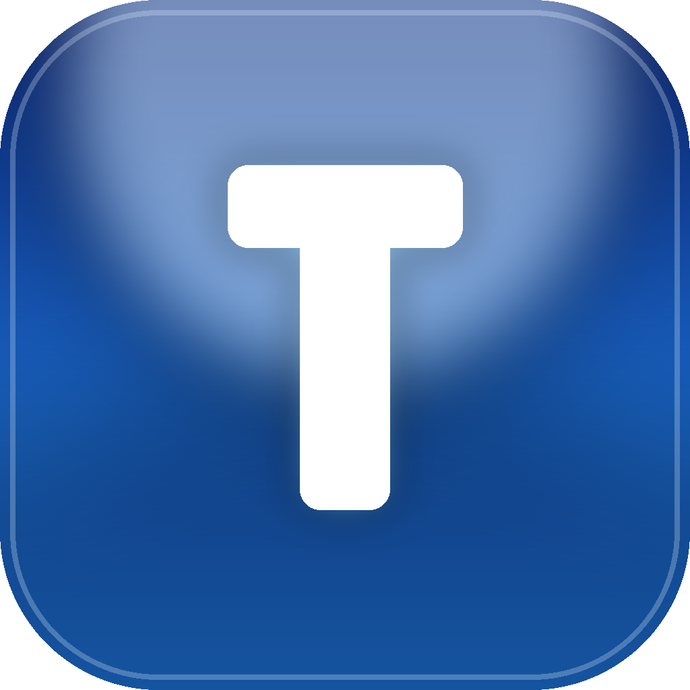
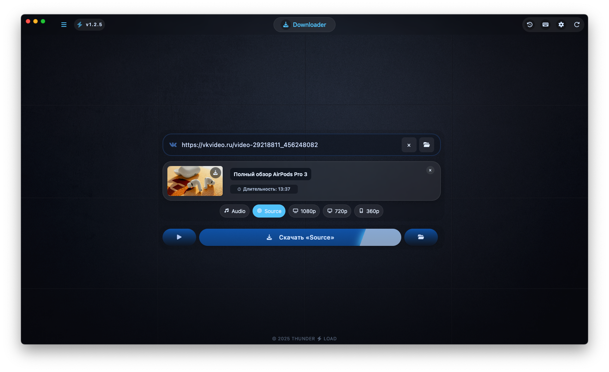
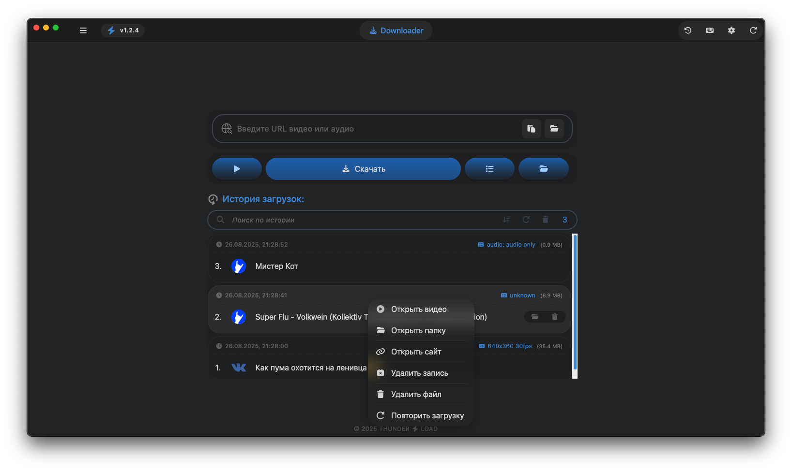

# ⚡ Thunder Load — Audio/Video downloader

<!-- Badges -->

[](https://github.com/Nagrands/thunder-load-app/actions)



## 📸 Screenshots

| Downloader                      | Settings                         |
| ------------------------------- | -------------------------------- |
|  |  |

## 📑 Table of Contents

- [English](#english)
- [Русский](#русский)
- [Українська](#українська)

## ⬇️ Download

[latest_version](https://github.com/Nagrands/thunder-load-app/releases/latest)

## English

ThunderLoad is a modern, cross‑platform video, audio, and file downloader built with [Electron](https://www.electronjs.org/).  
Designed for speed, simplicity, and a smooth user experience.

## Features

- **Fast:** 🚀 Fast video & audio downloading
- **Formats:** 🎯 Supports many formats: video (MP4, WebM, MKV, etc.) and audio (MP3, AAC, etc.)
- **Clipboard:** 📥 Clipboard monitoring for instant link detection
- **Quality:** ⚙️ Quality selection before download
- **History:** 📜 Download history with quick access
- **Updates:** 🔄 Automatic in‑app updates
- **Interface:** 🖥️ Clean & intuitive interface

## Installation

<details>
<summary><strong>macOS notice</strong></summary>

ThunderLoad for macOS is **not notarized**. When running the app, you may see a warning that it is damaged or cannot be opened.  
To run the app:

1. Move the `.app` to `/Applications`.
2. Open Terminal and run:
   ```
   sudo xattr -dr com.apple.quarantine /Applications/Thunder\ Load.app
   ```
3. Then open the app normally.

</details>

### Prerequisites

Make sure you have the following installed:

- **[Node.js](https://nodejs.org/)** — version 18 or higher recommended  
  Using a version manager like [`nvm`](https://github.com/nvm-sh/nvm) is advised.
- **npm** — comes with Node.js

### Steps

1. Clone the repository:
   ```bash
   git clone https://github.com/Nagrands/thunder-load-app.git
   ```
2. Change directory:
   ```bash
   cd thunder-load-app
   ```
3. Install dependencies:
   ```bash
   npm install
   ```

## Usage

To start the application in development mode:

```bash
npm start
```

To build the application for production:

```bash
npm run build
```

## Русский

ThunderLoad — это современный кроссплатформенный загрузчик видео, аудио и файлов, созданный на базе [Electron](https://www.electronjs.org/).  
Разработан для скорости, простоты и комфортного пользовательского опыта.

## Особенности

- **Быстрота:** 🚀 Быстрая загрузка видео и аудио
- **Форматы:** 🎯 Поддержка множества форматов: видео (MP4, WebM, MKV и др.) и аудио (MP3, AAC и др.)
- **Буфер обмена:** 📥 Мониторинг буфера обмена для мгновенного обнаружения ссылок
- **Качество:** ⚙️ Выбор качества перед загрузкой
- **История:** 📜 История загрузок с быстрым доступом
- **Обновления:** 🔄 Автоматические обновления внутри приложения
- **Интерфейс:** 🖥️ Чистый и интуитивно понятный интерфейс

## Установка

<details>
<summary><strong>Примечание для macOS</strong></summary>

Приложение ThunderLoad для macOS **не проходит нотарификацию**. При запуске система может показать предупреждение, что приложение повреждено или не может быть открыто.  
Чтобы запустить приложение:

1. Переместите `.app` в папку `/Applications`.
2. Откройте Терминал и выполните команду:
   ```
   sudo xattr -dr com.apple.quarantine /Applications/Thunder\ Load.app
   ```
3. Затем откройте приложение обычным способом.

</details>

### Необходимые компоненты

Убедитесь, что у вас установлены следующие компоненты:

- **[Node.js](https://nodejs.org/)** — рекомендуется версия 18 или выше  
  Рекомендуется использовать менеджер версий, например [`nvm`](https://github.com/nvm-sh/nvm).
- **npm** — поставляется вместе с Node.js

### Шаги

1. Клонируйте репозиторий:
   ```bash
   git clone https://github.com/Nagrands/thunder-load-app.git
   ```
2. Перейдите в папку проекта:
   ```bash
   cd thunder-load-app
   ```
3. Установите зависимости:
   ```bash
   npm install
   ```

## Использование

Чтобы запустить приложение в режиме разработки:

```bash
npm start
```

Чтобы собрать приложение для продакшна:

```bash
npm run build
```

## Українська

ThunderLoad — це сучасний кросплатформений завантажувач відео, аудіо та файлів, створений на основі [Electron](https://www.electronjs.org/).  
Розроблений для швидкості, простоти та комфортного користувацького досвіду.

## Можливості

- **Швидкість:** 🚀 Швидке завантаження відео та аудіо
- **Формати:** 🎯 Підтримка багатьох форматів: відео (MP4, WebM, MKV тощо) та аудіо (MP3, AAC тощо)
- **Буфер обміну:** 📥 Моніторинг буфера обміну для миттєвого виявлення посилань
- **Якість:** ⚙️ Вибір якості перед завантаженням
- **Історія:** 📜 Історія завантажень із швидким доступом
- **Оновлення:** 🔄 Автоматичні оновлення в додатку
- **Інтерфейс:** 🖥️ Чистий та інтуїтивно зрозумілий інтерфейс

## Встановлення

<details>
<summary><strong>Примітка для macOS</strong></summary>

Додаток ThunderLoad для macOS **не проходить нотаризацію**. Під час запуску система може показати попередження, що додаток пошкоджено або його неможливо відкрити.  
Щоб запустити додаток:

1. Перемістіть `.app` до папки `/Applications`.
2. Відкрийте Термінал і виконайте команду:
   ```
   sudo xattr -dr com.apple.quarantine /Applications/Thunder\ Load.app
   ```
3. Після цього відкрийте додаток як зазвичай.

</details>

### Необхідні компоненти

Переконайтеся, що у вас встановлено наступне:

- **[Node.js](https://nodejs.org/)** — рекомендовано версію 18 або вище  
  Рекомендується використовувати менеджер версій, наприклад [`nvm`](https://github.com/nvm-sh/nvm).
- **npm** — постачається разом із Node.js

### Кроки

1. Клонувати репозиторій:
   ```bash
   git clone https://github.com/Nagrands/thunder-load-app.git
   ```
2. Перейти в папку проекту:
   ```bash
   cd thunder-load-app
   ```
3. Встановити залежності:
   ```bash
   npm install
   ```

## Використання

Щоб запустити застосунок у режимі розробки:

```bash
npm start
```

Щоб зібрати застосунок для продакшну:

```bash
npm run build
```
