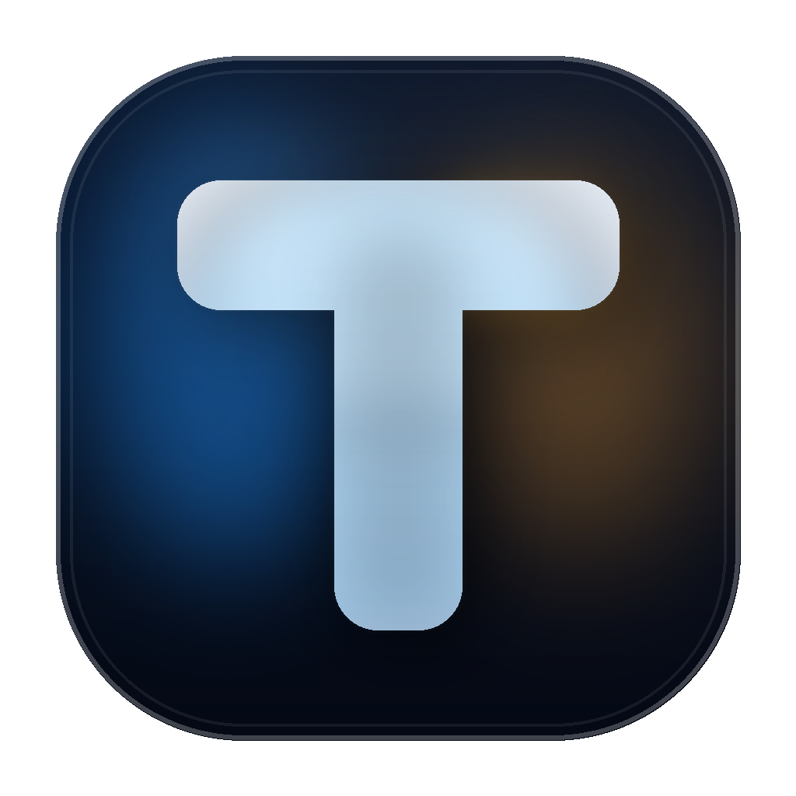
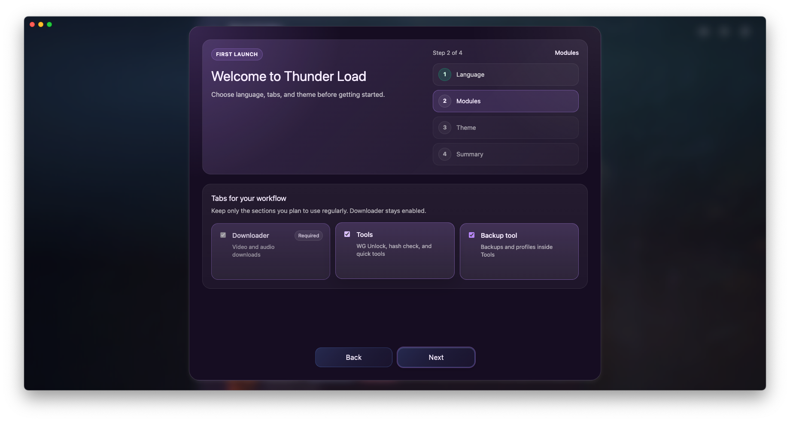
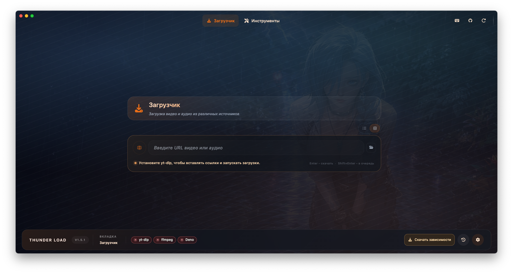
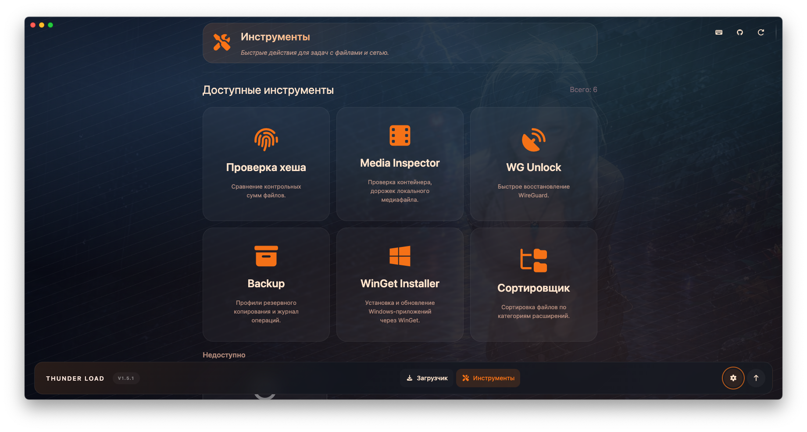

<p align="center">
  
</p>

<h1 align="center">Thunder Load</h1>

<p align="center"><em>Desktop media downloader and utility toolbox</em></p>

<p align="center">
  <a href="docs/README.ru.md">Русский</a> · <a href="docs/README.uk.md">Українська</a> · <a href="docs/APP.en.md">Application guide</a>
</p>

<p align="center">
  <a href="https://github.com/Nagrands/thunder-load-app/actions/workflows/release.yml">
    
  </a>
</p>

---

## Downloads

- Automated releases publish Windows (NSIS) and macOS (DMG/ZIP for Intel and Apple Silicon) artifacts on the [Releases](https://github.com/Nagrands/thunder-load-app/releases) page.
- Linux AppImage packaging is available through `npm run build-linux`, but it is not part of the current release workflow.
- Current macOS and Windows artifacts are unsigned.

---

## Features

- Video and audio downloads powered by `yt-dlp`, with `ffmpeg` processing.
- Video, video-only, audio, and MP3 quality choices before download.
- Persistent queue, playlist enqueueing, duplicate protection, and up to two parallel downloads.
- Clipboard detection, URL preview, YouTube background/live preview, and quick actions.
- Download history with search, source filters, sorting, pagination, undo, and CSV/JSON export.
- Products formatter for cleaning, grouping, validating, and copying structured product lists.
- Tools workspace with WG Unlock, Hash Check, Media Inspector, File Sorter, Backup, Windows shortcuts, and WinGet Installer.
- File Sorter uses persistent editable categories, mandatory operation preview, per-file selection, conflict handling, export, and one-step undo.
- Automatic application updates and managed `yt-dlp`, `ffmpeg`, `ffprobe`, and Deno dependencies.
- Russian and English interface, themes, keyboard shortcuts, and configurable modules.

See the [application guide](docs/APP.en.md) for section details and platform limitations.

## Screenshots

<p align="center">
  
</p>

<p align="center">
  
  
</p>

---

## Tech Stack & Tooling

- **Electron 39** - desktop runtime
- **Vanilla JavaScript** - main and renderer modules
- **Nunjucks** - generated application markup
- **SCSS** - component and platform styles
- **Jest and ESLint** - tests and static checks
- **yt-dlp, ffmpeg/ffprobe, and Deno** - managed runtime tools

### Scripts

| Command                                     | Purpose                                  |
| ------------------------------------------- | ---------------------------------------- |
| `npm start`                                 | Build generated assets and run the app   |
| `npm run dev`                               | Run in dev mode with `--dev` flag        |
| `npm run dev:watch`                         | Run development mode with file watchers  |
| `npm run build`                             | Package the app for your platform        |
| `npm run build-mac` / `npm run build-linux` | Platform-specific builds                 |
| `npm test`                                  | Run Jest tests                           |
| `npm run check`                             | Lint + tests                             |
| `npm run css:build`                         | Build CSS from SCSS                      |
| `npm run css:watch`                         | Watch & rebuild SCSS                     |
| `npm run templates:build`                   | Rebuild HTML from Nunjucks templates     |
| `npm run templates:watch`                   | Watch & rebuild templates on change      |
| `npm run whats-new:build`                   | Build release notes from `whats-new*.md` |
| `npm run whats-new:watch`                   | Watch & rebuild release notes            |
| `npm run format`                            | Format sources with Prettier             |

---

## Development

Clone the repository and install dependencies:

```bash
git clone https://github.com/Nagrands/thunder-load-app.git
cd thunder-load-app
npm install
```

Run the app in development mode:

```bash
npm run dev
```

If you edit templates, styles, or release notes, run the matching build scripts
or use the `*:watch` commands.

---

## Configuration

- Choose the downloads folder from Downloader. Settings controls the managed tools directory, language, theme, enabled modules, and Downloader behavior.
- Default data locations: macOS `~/Library/Application Support/Thunder Load`, Windows `%APPDATA%/Thunder Load`, Linux `~/.config/Thunder Load`.
- Use the Tools manager in Settings to inspect, update, reinstall, migrate, or reset runtime dependencies. Linux may require `ffmpeg`/`ffprobe` from the system package manager, and compatible tools can also be resolved from `PATH`.

## Documentation

- [Application guide](docs/APP.en.md)
- [Russian application guide](docs/APP.ru.md)
- [Developer workflow](docs/WORKFLOW.en.md)
- [D.O.C.S. delivery method](docs/DOCS.en.md)
- [Documentation index](docs/INDEX.md)

## Contributing

Open issues and pull requests on the [GitHub repository](https://github.com/Nagrands/thunder-load-app).
