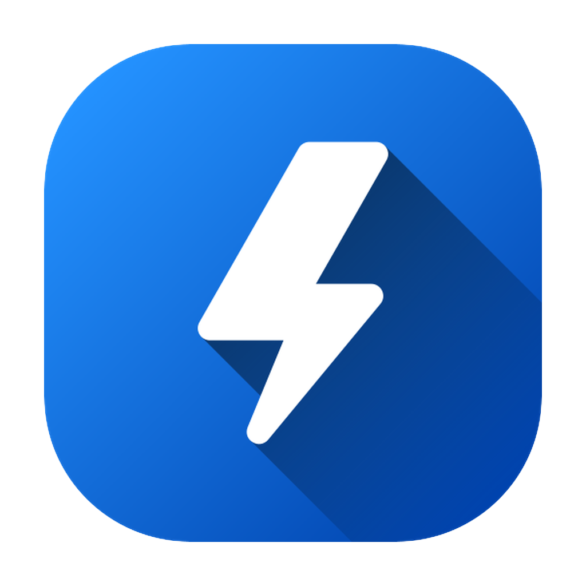

<p align="center">
  
</p>

<h1 align="center">Thunder Load</h1>

<p align="center"><em>Your fast, simple, and reliable video, audio, and file downloader</em></p>

<p align="center">
  <a href="docs/README.ru.md">Русский</a> · <a href="docs/README.uk.md">Українська</a>
</p>

<p align="center">
  <a href="https://github.com/Nagrands/thunder-load-app/actions/workflows/release.yml">
    
  </a>
</p>

---

## Downloads

- macOS (Apple/Intel), Windows, Linux builds are published on the [Releases](https://github.com/Nagrands/thunder-load-app/releases) page.
- Choose installer or portable (where available); macOS builds are **not notarized** (see Installation notes).

---

## Features

- 🚀 Fast video & audio downloads via yt-dlp
- 🎯 Multiple formats: MP4, WebM, MKV, MP3, AAC, etc.
- 📥 Clipboard watcher and quick paste
- ⚙️ Quality/resolution selection before download
- 📜 Download history with filters, pagination, CSV/JSON export
- 💾 Backup tab with reusable profiles (source → destination), filtering, and bulk actions
- 🔄 Automatic in-app updates and dependency bootstrap (yt-dlp, ffmpeg, Deno)
- 🖥️ Clean UI with tooltips and keyboard shortcuts

## 📸 Screenshots

<p align="center">
  
  
</p>
<p align="center">
  
  
</p>

---

## Tech Stack & Tooling

- **Electron** — Cross-platform desktop application framework
- **Node.js** — JavaScript runtime
- **npm** — Package manager
- **yt-dlp**, **ffmpeg**, **Deno** — auto-managed binaries stored under `userData/tools`

### Scripts

| Command                                     | Purpose                                            |
| ------------------------------------------- | -------------------------------------------------- |
| `npm start`                                 | Run the Electron app (builds templates beforehand) |
| `npm run dev`                               | Run in dev mode with `--dev` flag                  |
| `npm run build`                             | Package the app for your platform                  |
| `npm run build-mac` / `npm run build-linux` | Platform-specific builds                           |
| `npm test`                                  | Run Jest tests                                     |
| `npm run templates:build`                   | Rebuild HTML from Nunjucks templates               |
| `npm run templates:watch`                   | Watch & rebuild templates on change                |
| `npm run format`                            | Format sources with Prettier                       |

---

## Development

Clone the repository and install dependencies:

```bash
git clone https://github.com/Nagrands/thunder-load-app.git
cd thunder-load-app
npm install
```

Run the app in development mode:

```bash
npm start
```

## Installation

<details>
<summary><strong>macOS Notice</strong></summary>
ThunderLoad for macOS is **not notarized**. When running the app, you may see a warning that it is damaged or cannot be opened.

To run the app:

1. Move the `.app` to `/Applications`.
2. Open Terminal and run:
   ```
   sudo xattr -dr com.apple.quarantine /Applications/Thunder\ Load.app
   ```
3. Then open the app normally.

</details>

---

## Configuration

- Change downloads folder or tools directory in **Settings**.
- Default data locations: macOS `~/Library/Application Support/Thunder Load`, Windows `%APPDATA%/Thunder Load`, Linux `~/.config/Thunder Load`.
- To reset tools if they break, delete `userData/tools` and relaunch (will re-download).

## Contributing

Contributions are welcome! Please open issues and submit pull requests on the [GitHub repository](https://github.com/Nagrands/thunder-load-app).
